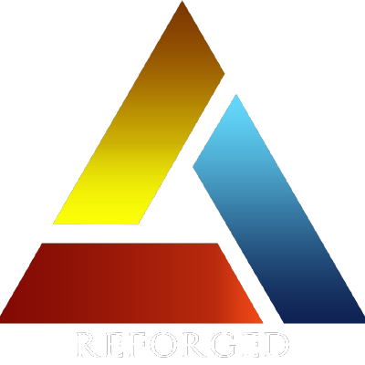
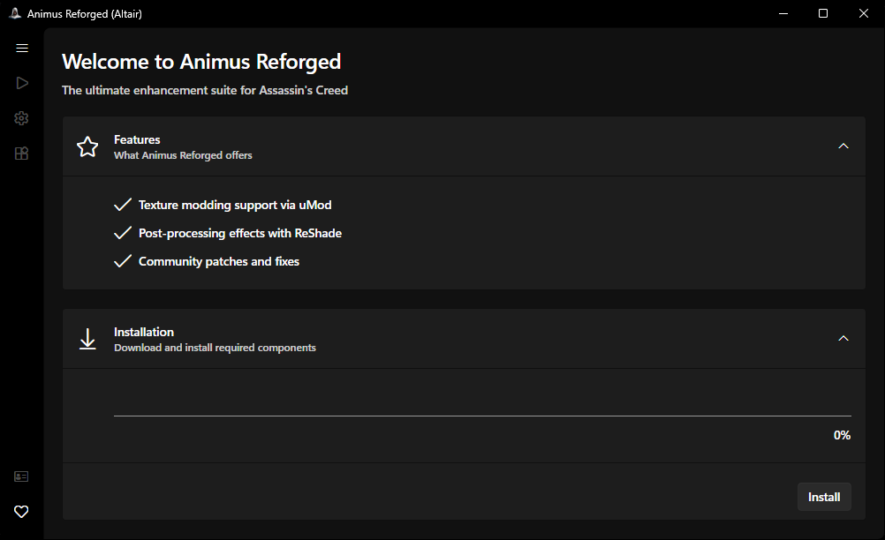
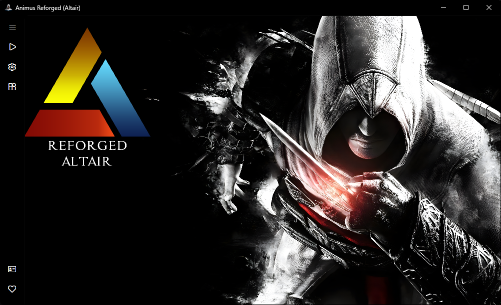

<h1 align="center"> Animus Reforged</h1>

  <b>Advanced Game Mod Manager & Launcher</b> 
  Powerful mod management and launching solution for Assassin's Creed games with integrated tools and real-time configuration.

---

  
  
  

  

  
  

  <a href="assets/screenshots/games/README.md">View Before/After Comparison</a>

---

## 🧾 Overview

**Animus Reforged** is a comprehensive open-source mod management and launching tool for **Assassin's Creed**. It delivers deep mod integration, real-time configuration management, and advanced mod loading capabilities to enhance your gaming experience. Built with modern .NET technology and a sleek Avalonia UI, it provides an intuitive interface for full control of your modded Assassin's Creed experience.

## 🎮 Supported Games

| Game | Supported | Notes |
|------|-----------|-------|
| Assassin's Creed (Altair) | ✅ | Full support with all mod management features |
| Assassin's Creed (Ezio) | ❌ | Coming soon/in development |
| Assassin's Creed Brotherhood | ❌ | Coming soon/in development |
| Assassin's Creed Revelations | ❌ | Coming soon/in development |

---

## 🌟 Features

### 📁 Mod Management

- All-in-one mod installation and management
- Mod updating
- Enable or disable mods with a single click
- Integrated utilities to repair broken mods

---

## 📚 Libraries Used

### 🖥️ User Interface

- [Avalonia](https://avaloniaui.net/) — Cross-platform .NET UI framework
- [Fluent Avalonia](https://github.com/amwx/FluentAvalonia) — Fluent Design System for Avalonia
- [Fluent Icons](https://github.com/davidxuang/FluentIcons) — Fluent icon set for modern interfaces

### ⚙️ Functionality

- [CommunityToolkit.Mvvm](https://github.com/CommunityToolkit/dotnet) — MVVM helpers and utilities
- [NLog](https://github.com/NLog/NLog) — Flexible and high-performance logging library
- [SharpCompress](https://github.com/adamhathcock/sharpcompress) — Compression library for handling archives

---

## 🙌 Credits

- `Ubisoft` — Creating Assassin's Creed games
- `Assassin's Creed Modding Community`
  - [uMod Tool](https://code.google.com/archive/p/texmod/) - Texture modifications without modifying game files
  - [Overhaul Mod (hecumarine)](https://www.moddb.com/mods/assassins-creed-2014-overhaul)
  - [EaglePatch](https://github.com/Sergeanur/EaglePatch)
  - [ReShade](https://reshade.me/) ([ReShade Preset](https://steamcommunity.com/sharedfiles/filedetails/?id=2957930769))

---

## ⚠️ Disclaimer

> This project is not affiliated with or endorsed by **Ubisoft**.
> "Assassin's Creed", "Altair", and related marks are trademarks of their respective owners.

---

## 🛠️ Contributing

Pull requests are welcome! If you'd like to improve this tool or report bugs, feel free to open an issue or start a discussion.

To contribute:

1. Fork the repository
2. Create a feature branch (`git checkout -b feature/amazing-feature`)
3. Commit your changes (`git commit -m 'Add amazing feature'`)
4. Push to the branch (`git push origin feature/amazing-feature`)
5. Open a pull request

---

## 📄 License

Released under the [BSD-3 License](LICENSE).

  <b> Made with ❤️ for Assassin's Creed community</b>

